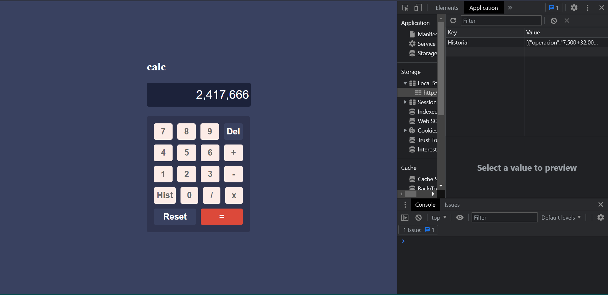
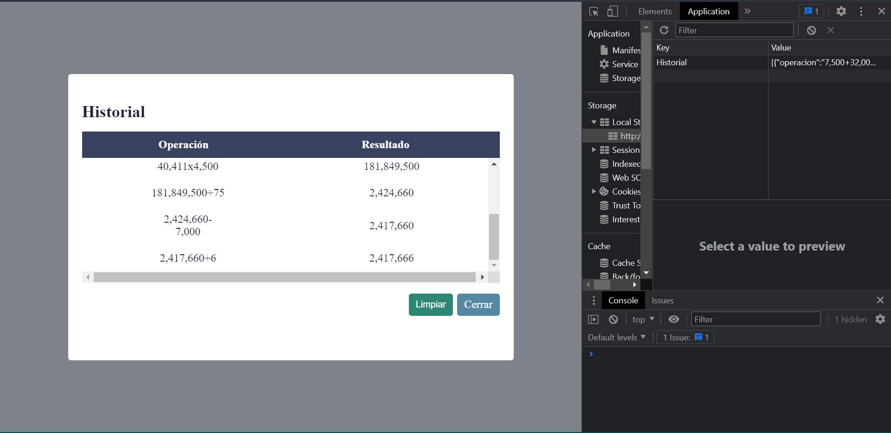

## Calculadora Web 

Calculadora en HTML5, JavaScript (ES5) adornada con CSS3, la cual hace las operaciones básicas de suma, resta, multiplicación y división. Se almacena un historial de los cálculos realizados hasta que el usuario decide eliminarlos.

Se utiliza la funcionalidad de localStorage para guardar el historial de las operaciones realizadas.

- Para abrir el historial debemos precionar el boton Hist.
- Para eliminar el historial se debe presionar el botón limpiar.

