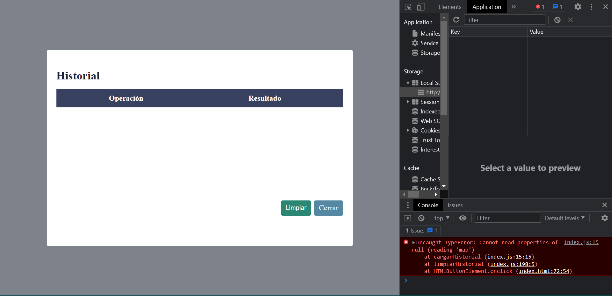

## Tarea #2 - Basilio Gianfranco De Paula Cuevas (2020-10552)

### Calculadora Web 

Haga una calculadora con HTML5 , JavaScript (ES5) adornada con CSS3, la cual debe hacer las operaciones básicas de suma, resta, multiplicación y división la cual almacene un historial de los cálculos hechos hasta que el usuario decida eliminarlos.

Utilice la funcionalidad de localStorage para guardar el historial de las operaciones
realizadas.

- Para abrir el historial debemos precionar el boton Hist.
- Para eliminar el historial se debe presionar el botón limpiar.

calculadoraVacia

